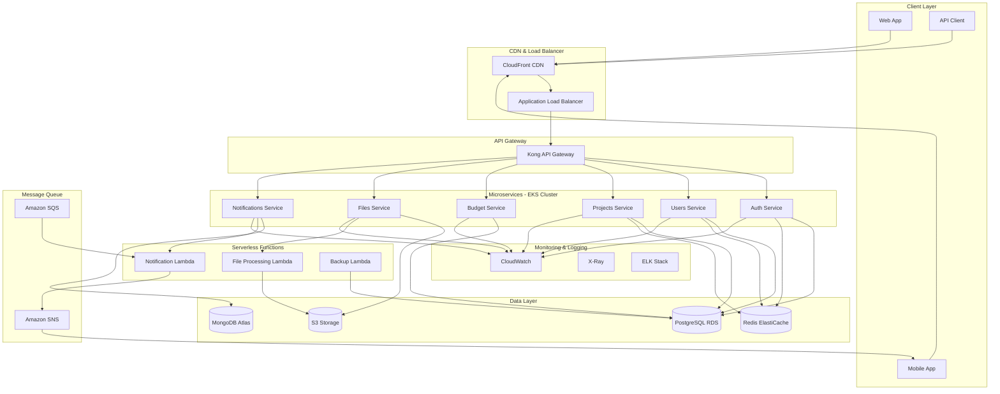

# Propuesta Arquitectónica - ProManage
## Plataforma de Gestión de Proyectos Escalable

### 📋 Información del Proyecto

- **Curso**: DevOps - Módulo 5: Diseño de Arquitectura y Escalabilidad
- **Empresa**: ProManage
- **Estudiante**: Juan Plaza de los Reyes
- **Fecha**: Julio 2025

---

## 🎯 Resumen Ejecutivo

Esta propuesta presenta una arquitectura basada en microservicios para la plataforma ProManage, diseñada para satisfacer los requerimientos de escalabilidad, resiliencia y seguridad. La solución utiliza Amazon EKS como orquestador, con una arquitectura híbrida que combina PaaS, IaaS y FaaS para optimizar costos y rendimiento.

### Funcionalidades Principales:
- ✅ Sistema de autenticación y autorización robusto
- ✅ Gestión completa de proyectos con CRUD
- ✅ Administración de presupuestos por proyecto
- ✅ Sistema de archivos y documentos escalable
- ✅ Gestión de fechas y plazos con notificaciones
- ✅ Perfiles de usuario con control de acceso basado en roles

---

## 1. Análisis de Requerimientos y Elección de Arquitectura

### 🔍 Identificación de Componentes Clave

#### Componentes Funcionales:
- **Servicio de Autenticación y Autorización**: JWT + OAuth2
- **Servicio de Gestión de Usuarios**: Perfiles y roles
- **Servicio de Gestión de Proyectos**: CRUD de proyectos
- **Servicio de Gestión de Presupuestos**: Asignación y seguimiento
- **Servicio de Gestión de Archivos**: Upload/download de documentos
- **Servicio de Notificaciones**: Alertas y recordatorios
- **API Gateway**: Punto de entrada único
- **Base de Datos**: Almacenamiento persistente
- **Cache**: Redis para optimización
- **Message Queue**: Para procesamiento asíncrono

#### Componentes No Funcionales:
- **Load Balancer**: Distribución de carga
- **Monitoring**: Observabilidad del sistema
- **Logging**: Centralización de logs
- **Security**: Encriptación y protección
- **Backup**: Respaldo de datos

### 🏗️ Justificación de Arquitectura: Microservicios

**Decisión**: Arquitectura basada en **Microservicios**

#### Ventajas para ProManage:
1. **Escalabilidad Granular**: Cada servicio puede escalar independientemente
2. **Tecnología Diversa**: Diferentes tecnologías por servicio según necesidades
3. **Desarrollo Paralelo**: Equipos pueden trabajar independientemente
4. **Resilencia**: Fallo de un servicio no compromete el sistema completo
5. **Despliegue Independiente**: Actualizaciones sin afectar otros servicios

#### Desventajas Consideradas:
- Mayor complejidad inicial
- Latencia de red entre servicios
- Gestión de datos distribuida

### ☁️ Elección de Estructura como Servicio

**Decisión**: Arquitectura híbrida **PaaS + IaaS + FaaS**

#### Distribución:
- **PaaS (40%)**:
  - Amazon EKS para orquestación
  - AWS RDS para bases de datos
  - ElastiCache para caché
  
- **IaaS (30%)**:
  - EC2 para servicios específicos
  - S3 para almacenamiento de archivos
  - EBS para volúmenes persistentes
  
- **FaaS (30%)**:
  - AWS Lambda para procesamiento de archivos
  - Lambda para notificaciones
  - Lambda para tareas de mantenimiento

---

## 2. Diseño de Infraestructura y Escalabilidad

### 🚀 Autoescalado y Balanceo de Carga

#### Horizontal Pod Autoscaler (HPA):
```yaml
apiVersion: autoscaling/v2
kind: HorizontalPodAutoscaler
metadata:
  name: promanage-projects-hpa
spec:
  scaleTargetRef:
    apiVersion: apps/v1
    kind: Deployment
    name: projects-service
  minReplicas: 2
  maxReplicas: 10
  metrics:
  - type: Resource
    resource:
      name: cpu
      target:
        type: Utilization
        averageUtilization: 70
  - type: Resource
    resource:
      name: memory
      target:
        type: Utilization
        averageUtilization: 80
```

#### Application Load Balancer (ALB):
- **Algoritmo**: Round Robin con health checks
- **SSL/TLS**: Terminación en el balanceador
- **Path-based routing**: Distribución por servicios
- **Sticky sessions**: Para servicios que lo requieran

### 🛡️ Estrategia de Resiliencia y Alta Disponibilidad

#### Multi-AZ Deployment:
- **Zonas de disponibilidad**: Mínimo 3 AZ
- **Replicación**: Bases de datos con réplicas de lectura
- **Failover**: Automático en caso de fallo

#### Circuit Breaker Pattern:
```javascript
const circuitBreaker = {
  failureThreshold: 5,
  timeout: 60000,
  resetTimeout: 30000,
  state: 'CLOSED' // CLOSED, OPEN, HALF_OPEN
};
```

#### Health Checks:
- **Liveness probes**: Verificación de vida del contenedor
- **Readiness probes**: Verificación de preparación para tráfico
- **Startup probes**: Verificación de inicio lento

### ⚙️ Justificación de Kubernetes

**Decisión**: **Amazon EKS** como plataforma de orquestación

#### Ventajas:
1. **Gestión Automática**: AWS maneja el control plane
2. **Integración**: Nativa con servicios AWS
3. **Seguridad**: IAM, VPC, y encriptación integrada
4. **Escalabilidad**: Auto Scaling Groups
5. **Monitoreo**: CloudWatch y X-Ray integrados

#### Configuración de Cluster:
- **Versión**: Kubernetes 1.28
- **Node Groups**:
  - Spot instances para desarrollo
  - On-demand para producción
- **Networking**: AWS VPC CNI
- **Storage**: EBS CSI driver

---

## 3. Contenedorización y Orquestación

### 🐳 Herramientas para Gestión de Contenedores

**Decisión**: **Docker** como runtime de contenedores

#### Dockerfile Ejemplo (Servicio de Proyectos):
```dockerfile
FROM node:18-alpine AS builder

WORKDIR /app
COPY package*.json ./
RUN npm ci --only=production

FROM node:18-alpine AS runtime

RUN addgroup -g 1001 -S nodejs
RUN adduser -S nodejs -u 1001

WORKDIR /app
COPY --from=builder /app/node_modules ./node_modules
COPY --chown=nodejs:nodejs . .

USER nodejs

EXPOSE 3000

HEALTHCHECK --interval=30s --timeout=3s --start-period=5s --retries=3 \
  CMD curl -f http://localhost:3000/health || exit 1

CMD ["node", "server.js"]
```

#### Alternativas Consideradas:
- **Podman**: Ventajas en seguridad (rootless), pero menor ecosistema
- **containerd**: Más ligero, pero menos features para desarrollo

### ⚓ Proceso de Orquestación con Kubernetes

#### Deployment Strategy:
```yaml
apiVersion: apps/v1
kind: Deployment
metadata:
  name: projects-service
  labels:
    app: projects-service
spec:
  replicas: 3
  strategy:
    type: RollingUpdate
    rollingUpdate:
      maxSurge: 1
      maxUnavailable: 0
  selector:
    matchLabels:
      app: projects-service
  template:
    metadata:
      labels:
        app: projects-service
    spec:
      containers:
      - name: projects-service
        image: promanage/projects-service:v1.0.0
        ports:
        - containerPort: 3000
        env:
        - name: DB_HOST
          valueFrom:
            configMapKeyRef:
              name: db-config
              key: host
        - name: DB_PASSWORD
          valueFrom:
            secretKeyRef:
              name: db-secret
              key: password
        resources:
          requests:
            memory: "256Mi"
            cpu: "250m"
          limits:
            memory: "512Mi"
            cpu: "500m"
        livenessProbe:
          httpGet:
            path: /health
            port: 3000
          initialDelaySeconds: 30
          periodSeconds: 10
        readinessProbe:
          httpGet:
            path: /ready
            port: 3000
          initialDelaySeconds: 5
          periodSeconds: 5
```

#### Service Discovery:
```yaml
apiVersion: v1
kind: Service
metadata:
  name: projects-service
spec:
  selector:
    app: projects-service
  ports:
    - protocol: TCP
      port: 80
      targetPort: 3000
  type: ClusterIP
```

### 📦 Gestión de Registros de Contenedores

**Decisión**: **Amazon ECR** como registro principal

#### Pipeline de CI/CD:
```yaml
# .github/workflows/deploy.yml
name: Deploy to EKS

on:
  push:
    branches: [ main ]

jobs:
  deploy:
    runs-on: ubuntu-latest
    steps:
    - uses: actions/checkout@v3
    
    - name: Configure AWS credentials
      uses: aws-actions/configure-aws-credentials@v1
      with:
        aws-access-key-id: ${{ secrets.AWS_ACCESS_KEY_ID }}
        aws-secret-access-key: ${{ secrets.AWS_SECRET_ACCESS_KEY }}
        aws-region: us-east-1
    
    - name: Login to Amazon ECR
      id: login-ecr
      uses: aws-actions/amazon-ecr-login@v1
    
    - name: Build and push Docker image
      env:
        ECR_REGISTRY: ${{ steps.login-ecr.outputs.registry }}
        ECR_REPOSITORY: promanage/projects-service
        IMAGE_TAG: ${{ github.sha }}
      run: |
        docker build -t $ECR_REGISTRY/$ECR_REPOSITORY:$IMAGE_TAG .
        docker push $ECR_REGISTRY/$ECR_REPOSITORY:$IMAGE_TAG
    
    - name: Deploy to EKS
      run: |
        aws eks update-kubeconfig --region us-east-1 --name promanage-cluster
        kubectl set image deployment/projects-service projects-service=$ECR_REGISTRY/$ECR_REPOSITORY:$IMAGE_TAG
```

#### Registro Alternativo:
- **Docker Hub**: Para imágenes base y públicas
- **GitHub Packages**: Para dependencias internas

---

## 4. Diagramas de Arquitectura y Herramientas Integradas

### 🎨 Diagrama de Arquitectura General



### 📊 Diagrama de Flujo 1: Proceso de Autenticación y Autorización


### 📊 Diagrama de Flujo 2: Gestión de Proyectos y Archivos

```mermaid
flowchart TD
    A[Usuario Crea Proyecto] --> B[Validar Datos de Entrada]
    B --> C{¿Datos Válidos?}
    C -->|No| D[Mostrar Errores de Validación]
    D --> A
    C -->|Sí| E[Crear Proyecto en BD]
    E --> F[Inicializar Presupuesto]
    F --> G[Crear Estructura de Archivos en S3]
    G --> H[Enviar Notificación a Equipo]
    H --> I[Proyecto Creado Exitosamente]
    
    I --> J[Usuario Sube Archivo]
    J --> K[Validar Tipo y Tamaño]
    K --> L{¿Archivo Válido?}
    L -->|No| M[Error de Validación]
    L -->|Sí| N[Procesar con Lambda]
    N --> O[Escanear Virus]
    O --> P{¿Archivo Seguro?}
    P -->|No| Q[Rechazar Archivo]
    P -->|Sí| R[Comprimir y Optimizar]
    R --> S[Subir a S3]
    S --> T[Actualizar Metadata en BD]
    T --> U[Generar URL de Acceso]
    U --> V[Notificar Usuarios Autorizados]
    V --> W[Archivo Disponible]
    
    X[Actualizar Proyecto] --> Y[Verificar Permisos]
    Y --> Z{¿Usuario Autorizado?}
    Z -->|No| AA[Error 403]
    Z -->|Sí| BB[Aplicar Cambios]
    BB --> CC[Registrar Auditoría]
    CC --> DD[Actualizar Cache]
    DD --> EE[Notificar Cambios]
    EE --> FF[Proyecto Actualizado]
    
    style A fill:#e1f5fe
    style I fill:#e8f5e8
    style W fill:#e8f5e8
    style FF fill:#e8f5e8
    style D fill:#ffebee
    style M fill:#ffebee
    style Q fill:#ffebee
    style AA fill:#ffebee
```



### 🔧 Stack Tecnológico Seleccionado

#### **Frontend y Clientes**
- **Aplicación Web**: React.js 18 con Next.js 13 para SSR y optimización
- **Aplicación Móvil**: React Native con Expo para desarrollo multiplataforma
- **Gestión de Estado**: Redux Toolkit para manejo de estado global
- **UI Framework**: Material-UI v5 con Tailwind CSS para diseño responsivo
- **Autenticación Cliente**: Auth0 SDK para integración segura

#### **Backend y Microservicios**
- **API Gateway**: Kong Gateway para enrutamiento y políticas de seguridad
- **Runtime**: Node.js 18 LTS para todos los microservicios
- **Framework**: Express.js con TypeScript para desarrollo robusto
- **Autenticación**: JWT + OAuth2 con Auth0 como proveedor
- **Documentación API**: OpenAPI 3.0 con Swagger UI

#### **Bases de Datos y Almacenamiento**
- **Base de Datos Principal**: PostgreSQL 14 en AWS RDS Multi-AZ
- **Cache**: Redis 7.0 en AWS ElastiCache con clustering
- **Almacenamiento de Archivos**: Amazon S3 con versioning y lifecycle policies
- **Base de Datos NoSQL**: MongoDB Atlas para logs y notificaciones
- **Búsqueda**: Amazon OpenSearch para búsqueda avanzada

#### **Infraestructura y Orquestación**
- **Contenedores**: Docker 24.0 con multi-stage builds
- **Orquestación**: Amazon EKS v1.28 con Fargate
- **Service Mesh**: Istio para comunicación segura entre servicios
- **Ingress Controller**: AWS Load Balancer Controller
- **Registry**: Amazon ECR para imágenes de contenedores

#### **Serverless y Procesamiento**
- **Functions**: AWS Lambda con Node.js 18 runtime
- **Event Processing**: Amazon SQS + SNS para mensajería
- **Scheduled Tasks**: Amazon EventBridge para tareas programadas
- **API Gateway**: AWS API Gateway para endpoints serverless

#### **Monitoreo y Observabilidad**
- **Métricas**: Amazon CloudWatch + Prometheus
- **Logging**: AWS CloudWatch Logs + ELK Stack
- **Tracing**: AWS X-Ray para trazabilidad distribuida
- **Alertas**: Amazon SNS + PagerDuty para incidentes críticos
- **Dashboards**: Grafana para visualización de métricas

#### **Seguridad y Compliance**
- **WAF**: AWS WAF para protección de aplicaciones web
- **Secrets**: AWS Secrets Manager para credenciales
- **Encryption**: AWS KMS para cifrado de datos
- **Identity**: AWS IAM + RBAC para control de acceso
- **Compliance**: AWS Config para auditoría y compliance

#### **DevOps y CI/CD**
- **Version Control**: Git con GitHub
- **CI/CD**: GitHub Actions con workflows automatizados
- **Infrastructure as Code**: Terraform para provisioning
- **Configuration Management**: Helm charts para Kubernetes
- **Quality Gates**: SonarQube para análisis de código

#### **Networking y CDN**
- **CDN**: Amazon CloudFront para distribución global
- **DNS**: Amazon Route 53 con health checks
- **Load Balancer**: AWS Application Load Balancer
- **VPC**: Amazon VPC con subredes públicas y privadas
- **Certificate Management**: AWS Certificate Manager

Este stack tecnológico ha sido seleccionado considerando:
- **Escalabilidad**: Capacidad de crecimiento horizontal y vertical
- **Rendimiento**: Optimización de latencia y throughput
- **Seguridad**: Mejores prácticas de seguridad empresarial
- **Costo-efectividad**: Optimización de costos operativos
- **Mantenibilidad**: Facilidad de mantenimiento y actualizaciones

### 📊 Análisis de Comunicación entre Servicios

#### **Patrón de Comunicación Síncrona:**


#### **Patrón de Comunicación Asíncrona:**


---

## 📈 Justificación de Decisiones Arquitectónicas

### **¿Por qué Microservicios sobre Monolito?**

**Ventajas Específicas para ProManage:**
1. **Escalabilidad Independiente**: El servicio de archivos puede escalar independientemente durante picos de carga
2. **Tecnologías Especializadas**: Diferentes servicios pueden usar tecnologías optimizadas para su dominio
3. **Desarrollo Paralelo**: Equipos pueden trabajar en diferentes servicios sin conflictos
4. **Resilencia**: Fallo del servicio de notificaciones no afecta la gestión de proyectos
5. **Despliegue Independiente**: Actualizaciones sin downtime del sistema completo

**Desafíos Mitigados:**
- **Complejidad**: Uso de service mesh (Istio) para simplificar comunicación
- **Latencia**: Implementación de cache distribuido con Redis
- **Consistencia**: Event sourcing y patrones saga para transacciones distribuidas

### **¿Por qué Arquitectura Híbrida PaaS + IaaS + FaaS?**

**Distribución Justificada:**
- **PaaS (50%)**: EKS, RDS, ElastiCache - Servicios core que requieren disponibilidad constante
- **IaaS (30%)**: EC2, S3, EBS - Control granular sobre recursos específicos
- **FaaS (20%)**: Lambda - Procesamiento de eventos y tareas puntuales

**Beneficios:**
- **Costo-Efectividad**: Pago por uso en Lambda, recursos dedicados donde se necesita
- **Mantenimiento Reducido**: AWS maneja la infraestructura subyacente
- **Escalabilidad Automática**: Servicios se escalan según demanda

### **¿Por qué Amazon EKS sobre Alternativas?**

**Comparación con Alternativas:**
- **ECS**: Menos flexible para workloads complejos
- **EKS Fargate**: Mejor para esta escala, sin gestión de nodos
- **Self-managed K8s**: Mayor overhead operativo
- **Google GKE**: Vendor lock-in con Google Cloud

**Ventajas de EKS:**
- **Integración AWS**: Nativa con todos los servicios AWS
- **Seguridad**: IAM, VPC, KMS integrados
- **Ecosystem**: Amplio ecosistema de herramientas Kubernetes
- **Soporte**: Soporte empresarial de AWS

---

## 🔄 Estrategias de Escalabilidad Avanzadas

### **Escalabilidad Horizontal Predictiva**

**Horizontal Pod Autoscaler (HPA) Avanzado:**
```yaml
apiVersion: autoscaling/v2
kind: HorizontalPodAutoscaler
metadata:
  name: promanage-projects-hpa
spec:
  scaleTargetRef:
    apiVersion: apps/v1
    kind: Deployment
    name: projects-service
  minReplicas: 3
  maxReplicas: 50
  metrics:
  - type: Resource
    resource:
      name: cpu
      target:
        type: Utilization
        averageUtilization: 60
  - type: Resource
    resource:
      name: memory
      target:
        type: Utilization
        averageUtilization: 70
  - type: Pods
    pods:
      metric:
        name: requests_per_second
      target:
        type: AverageValue
        averageValue: "100"
  behavior:
    scaleDown:
      stabilizationWindowSeconds: 300
      policies:
      - type: Percent
        value: 10
        periodSeconds: 60
    scaleUp:
      stabilizationWindowSeconds: 60
      policies:
      - type: Percent
        value: 50
        periodSeconds: 30
```

**Cluster Autoscaler con Spot Instances:**
```yaml
apiVersion: v1
kind: ConfigMap
metadata:
  name: cluster-autoscaler-status
  namespace: kube-system
data:
  nodes.max: "100"
  nodes.min: "3"
  scale-down-delay-after-add: "10m"
  scale-down-unneeded-time: "10m"
  skip-nodes-with-local-storage: "false"
  skip-nodes-with-system-pods: "false"
```

### **Escalabilidad de Base de Datos**

**PostgreSQL Read Replicas:**
- **Replica Principal**: us-east-1a (escritura)
- **Replica Lectura 1**: us-east-1b (consultas de reportes)
- **Replica Lectura 2**: us-east-1c (consultas de analytics)
- **Failover Automático**: RDS Multi-AZ con 30 segundos RTO

**Redis Cluster Configuration:**
```yaml
apiVersion: v1
kind: ConfigMap
metadata:
  name: redis-cluster-config
data:
  redis.conf: |
    cluster-enabled yes
    cluster-config-file nodes.conf
    cluster-node-timeout 5000
    appendonly yes
    maxmemory-policy allkeys-lru
    maxmemory 2gb
```

### **Escalabilidad Geográfica**

**Multi-Region Architecture:**
- **Región Primaria**: us-east-1 (Norte América)
- **Región Secundaria**: eu-west-1 (Europa)
- **Región Terciaria**: ap-southeast-1 (Asia)

**Global Load Balancer con Route 53:**
```yaml
Type: AWS::Route53::RecordSet
Properties:
  HostedZoneId: !Ref HostedZone
  Name: api.promanage.com
  Type: A
  SetIdentifier: us-east-1
  GeolocationLocation:
    CountryCode: US
  TTL: 60
  ResourceRecords:
    - !GetAtt USEast1ALB.DNSName
  HealthCheckId: !Ref USEast1HealthCheck
```

---

## 🔒 Consideraciones de Seguridad

### **1. Perímetro de Red:**
- **AWS WAF**: Protección contra OWASP Top 10
- **Shield Advanced**: Protección DDoS
- **VPC**: Aislamiento de red con subredes privadas
- **NACLs**: Control de acceso a nivel de subred
- **Security Groups**: Firewall a nivel de instancia

### **2. Autenticación y Autorización:**
- **OAuth 2.0 + OpenID Connect**: Estándar de la industria
- **JWT**: Tokens firmados para acceso seguro

### Autenticación y Autorización:
- **JWT tokens**: Con expiración y refresh
- **RBAC**: Role-Based Access Control
- **OAuth2**: Para integraciones externas

### Comunicación:
- **TLS 1.3**: Para todas las comunicaciones
- **mTLS**: Entre microservicios
- **API Rate Limiting**: Prevención de abuso

### Datos:
- **Encryption at rest**: AWS KMS
- **Encryption in transit**: TLS
- **Secrets management**: AWS Secrets Manager

---

## 📊 Monitoreo y Observabilidad

### Métricas:
- **Application**: Custom metrics con Prometheus
- **Infrastructure**: CloudWatch
- **Business**: Dashboards en Grafana

### Logging:
- **Centralized**: ELK Stack
- **Structured**: JSON format
- **Correlation**: Trace IDs

### Alerting:
- **Critical**: PagerDuty
- **Warnings**: Slack notifications
- **Dashboards**: Real-time monitoring

---

## 💰 Estimación de Costos

### Servicios AWS (mensual):
- **EKS Cluster**: $73
- **EC2 Instances**: $200-400
- **RDS**: $150-300
- **ElastiCache**: $50-100
- **S3**:
